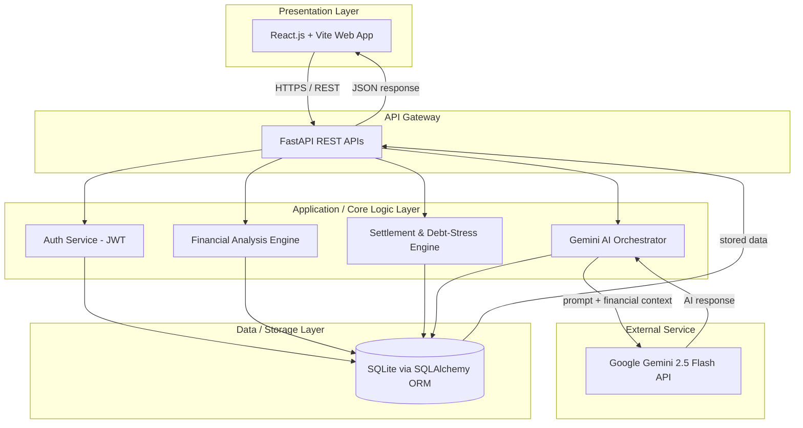
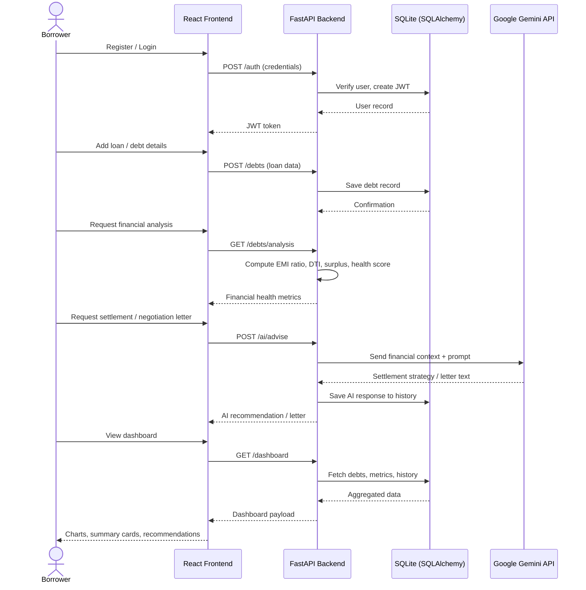
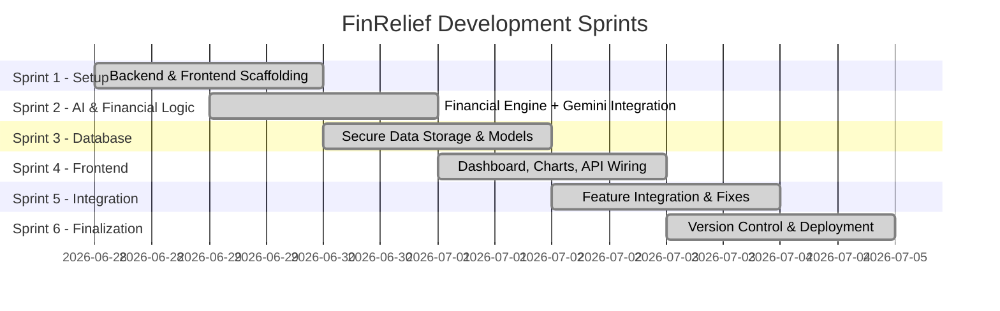

# 💳 FinRelief — AI Powered Debt Relief & Financial Recovery Platform

> An intelligent, AI-assisted web platform that helps distressed borrowers understand their debt, calculate financial stress, and generate professional, lender-ready negotiation letters — all from a single dashboard.

**Status:** Implemented | **Backend:** FastAPI | **Frontend:** React + Vite | **Database:** SQLite / SQLAlchemy | **AI:** Google Gemini 2.5 Flash

---

## 📑 Table of Contents

1. [Introduction](#1-introduction)
2. [Brainstorming & Idea Prioritization](#2-brainstorming--idea-prioritization)
3. [Requirement Analysis](#3-requirement-analysis)
4. [Project Design Phase](#4-project-design-phase)
5. [Project Planning Phase](#5-project-planning-phase)
6. [Project Development Phase](#6-project-development-phase)
7. [Project Testing](#7-project-testing)
8. [Project Documentation](#8-project-documentation)
9. [Project Demonstration](#9-project-demonstration)
10. [Repository Structure](#10-repository-structure)
11. [Getting Started Locally](#11-getting-started-locally)
12. [End-to-End Workflow (Theory + Diagrams)](#12-end-to-end-workflow-theory--diagrams)
13. [Scalability & Future Roadmap](#13-scalability--future-roadmap)
14. [Conclusion](#14-conclusion)
15. [Summary](#15-summary)

---

## 1. Introduction

Millions of borrowers fall behind on credit card and bank loan payments every year, but very few of them have access to the legal vocabulary, financial modeling tools, or negotiation experience needed to reach a fair settlement with a lender. Banks, on the other hand, rely on rigid recovery grids and aggressive third-party collection channels that rarely account for a borrower's real repayment capacity.

**FinRelief** closes this gap. It is a full-stack, AI-powered web application that:

- Lets a borrower securely register, log in, and record every loan/debt they hold.
- Automatically computes objective financial-stress metrics (EMI-to-Income ratio, Debt-to-Income ratio, monthly surplus, financial health score).
- Uses **Google Gemini 2.5 Flash** to generate personalized settlement recommendations and professional hardship/negotiation letters.
- Visualizes everything on a real-time financial dashboard.

This README consolidates and numbers the documentation produced across all eight project phases (found in this repository's numbered folders), explains the system's workflow both visually and theoretically, and provides setup instructions for running the project locally.

---

## 2. Brainstorming & Idea Prioritization
*(Folder: `1. Brainstorming & Idea Prioritization/`)*

| Document | Summary |
|---|---|
| **Brainstorming & Idea Prioritization.pdf** | The team generated individual ideas (FastAPI REST routing, a React + Vite dashboard, real-time EMI stress analysis, Gemini-based hardship letters, and SQLite profile storage), grouped them, and scored each group on feasibility and importance. Three ideas were prioritized: the **FastAPI Financial Calculator Module**, the **Gemini AI Negotiation Letter Engine**, and the **SQLite Local History Ledger System** — all rated High feasibility/importance. |
| **Define Problem Statements.pdf** | Defines two core customer problem statements: (PS-1) a distressed borrower who lacks the legal/financial vocabulary to negotiate a lump-sum settlement, and (PS-2) a defaulting customer who has no objective tool to calculate whether they qualify for hardship relief. Both statements highlight anxiety, helplessness, and confusion as the emotional drivers behind the problem. |
| **Empathy Map.pdf** | Frames the target user's experience across four lenses — **Say, Think, Do, Feel** — to keep the solution borrower-centric rather than bank-centric. |

**Key takeaway:** the project idea was validated around three pillars — automated financial calculation, AI-generated negotiation content, and a persistent history of past recommendations.

---

## 3. Requirement Analysis
*(Folder: `2. Requirement Analysis/`)*

| Document | Summary |
|---|---|
| **Customer Journey Map.pdf** | Maps the borrower's journey across 3 stages: **(1) Registration & Login → (2) Loan Analysis & AI Prediction → (3) Settlement & Dashboard Actions**, capturing actions, touchpoints, thoughts, feelings, and improvement opportunities at each stage. |
| **Data Flow Diagram.pdf** | Defines the DFD notation (external entities, processes, data stores, data flows) used to model how loan and profile data move between the user, the FastAPI backend, and the SQLite data store. |
| **Solution Requirements.pdf** | Lists **8 Functional Requirements** (authentication, authorization, external AI/DB interfaces, transaction processing, reporting, business rules, compliance, and history tracking) and **6 Non-Functional Requirements** (performance < 2s response, scalability to 5,000+ users, 100% encrypted credentials, 99.9% uptime, responsive UI, modular/cloud-ready code). |
| **Technology Stack.pdf** | Documents the chosen stack: **React.js + Vite** (frontend), **Python 3.11 + FastAPI** (backend), **SQLite + SQLAlchemy ORM** (database), **Docker + Google Cloud Platform** (hosting), **Git/GitHub** (version control), and **Google Gemini API + Postman + VS Code** (AI & tooling). |

---

## 4. Project Design Phase
*(Folder: `3. Project design phase/`)*

| Document | Summary |
|---|---|
| **Problem-Solution Fit.pdf** | A Problem-Solution Fit Canvas covering customer segments (retail borrowers, credit-card defaulters), root causes (no automated guidance, rigid recovery grids), triggers to act (legal notices, sudden income loss), and the proposed solution: an AI debt-relief assistant with automated stress calculation and letter generation. |
| **Proposed Solution.pdf** | The formal proposal: use mathematical rule engines to compute Debt-to-Income weightings, paired with the Google Gemini SDK to auto-generate bank-ready hardship declarations. Lists hardware (dual-core CPU, 8GB RAM, 256GB SSD) and software resources (FastAPI, React.js, `google-genai` SDK, SQLAlchemy, Pydantic, Axios). |
| **Solution Architecture.pdf** | Defines a 3-layer architecture: **Presentation Layer** (React.js + Vite) → **API Gateway** (FastAPI REST APIs) → **Data/Storage Layer** (SQLite + SQLAlchemy), with an **Auth Service** and **Core Logic Service** (financial analysis, settlement engine, debt-stress analysis) sitting in between. |

---

## 5. Project Planning Phase
*(Folder: `4. Project Planning Phase/`)*

The **Project Planning.pdf** breaks the build into **6 sprints**, each mapped to an epic:

1. **Sprint 1 — Epic 1:** Application setup (Python backend config, dependency installs, React + Vite scaffolding, modular folder structure).
2. **Sprint 2 — Epic 2:** AI integration & financial processing (FastAPI request handling, debt-metric calculations, settlement prediction, Gemini-based negotiation strategies, AI fallback logic).
3. **Sprint 3 — Epic 3:** Database management (secure API–DB connections, loan/settlement record storage, efficient data handling).
4. **Sprint 4 — Epic 4:** Frontend integration (dashboard UI, API communication, charts/visual financial metrics).
5. **Sprint 5 — Epic 5:** *(feature completion & integration testing, referenced in the planning timeline)*.
6. **Sprint 6 — Epic 6:** Version control, finalization & deployment (GitHub setup, clean modular structure, production-ready deployment configuration).

Each user story was estimated with story points and assigned an owner and start/end date, following an Agile/Scrum backlog format.

---

## 6. Project Development Phase
*(Folder: `5. Project Development Phase/`)*

| Document | Summary |
|---|---|
| **Code-Layout, Readability and Reusability.pdf** | Self-assessed code quality checklist — consistent indentation, separated frontend/backend/database folders, meaningful naming (`loanAmount`, `calculateFinancialHealth()`), modular design, and minimal duplication. Overall score: **5/5** across layout, readability, reusability, and documentation. |
| **Coding & Solution.pdf** | Confirms the implemented feature set: registration/login, JWT auth, loan management, financial health analysis, DTI ratio, settlement prediction, AI negotiation letters, dashboard, and AI history. Notes pending items: email notifications, credit-score integration, payment gateway, multi-language support. |
| **No. of Functional Features Included in the Solution.pdf** | Tracks **8 of 8 planned features implemented and tested** (100%), broken down across UI, backend logic, database, API integration, and security categories. |

---

## 7. Project Testing
*(Folder: `6.Project Testing/`)*

**Performance Testing.pdf** — load-tested the `POST /api/chat` endpoint using **k6**:

| Test Scenario | Virtual Users | Duration | Result |
|---|---|---|---|
| Normal Load | 10 | 30s | Pass |
| Medium Load | 25 | 30s | Pass |
| High Load | 50 | 60s | Pass |
| Peak Load | 100 | 30s | Pass |

**Results:** average response time **2.1 ms**, max **7.73 ms**, throughput **~9.97 req/sec**, **0% error rate**, CPU usage **4%**, memory usage **1.7%** — all comfortably within target thresholds, with no bottlenecks identified.

---

## 8. Project Documentation
*(Folder: `7.Project Documentation/`)*

| Document | Summary |
|---|---|
| **Project Executable Files.pdf** | Submission checklist confirming source code, setup guide, dependency files, environment config, and deployed URLs were all delivered. Documents the **live deployment**: frontend on Render, backend on Render, with demo credentials and a linked demo video. Also lists known limitations (SQLite write-locking under heavy load, AI-service dependency, free-tier cold starts). |
| **Sample Project Documentation.pdf** | A full narrative project report covering the project description, usage scenarios (loan entry → financial analysis → AI settlement suggestions → negotiation letter generation → dashboard monitoring), technical architecture, prerequisites, and a milestone-based project workflow (Model Selection → Core Functionality → Backend → Frontend → Deployment). |

---

## 9. Project Demonstration
*(Folder: `8.Project Demonstration/`)*

| Document | Summary |
|---|---|
| **Communication.pdf** | Documents the team's communication cadence: daily standups, weekly progress reviews, as-needed bug calls, bi-weekly stakeholder reviews, and one final demo rehearsal — all via Google Meet. |
| **Demonstration of Proposed Features.pdf** | Confirms **5/5 core features** (AI Financial Advisor, Debt Management, AI Settlement Analysis, Hardship Letter Generator, User Profile & Dashboard) were implemented **and** demonstrated — a **100% implementation rate**. |
| **Project Demo Planning.pdf** | A timed demo script: introduction & problem (0.5 min) → dashboard walkthrough (1.5 min) → debt management (1.5 min) → settlement analysis (0.5 min) → AI advisor (0.5 min) → letter generator (1 min) → live Q&A. |
| **Scalability & Future Plan.pdf** | Identifies current bottlenecks (SQLite's single-write lock, synchronous/blocking Gemini API calls) and proposes a phased roadmap — see [Section 13](#13-scalability--future-roadmap). |
| **Team Involvement in Demonstration.pdf** | Confirms every team member had an active speaking role in the final demo, and documents how an `.env` misconfiguration during the live demo was resolved on the spot. |

---

## 10. Repository Structure

```
AI-Powered-Debt-Relief-Financial-Recovery-Platform/
│
├── 1. Brainstorming & Idea Prioritization/   # Ideation, problem statements, empathy map
├── 2. Requirement Analysis/                  # Journey map, DFD, requirements, tech stack
├── 3. Project design phase/                  # Problem-solution fit, proposal, architecture
├── 4. Project Planning Phase/                # Sprint-wise product backlog
├── 5. Project Development Phase/              # Code quality & feature completion reports
├── 6.Project Testing/                        # k6 performance testing report
├── 7.Project Documentation/                  # Executable files & full project report
├── 8.Project Demonstration/                  # Communication, demo plan, scalability plan
│
├── finrelief-backend/                        # FastAPI backend service
│   ├── app/
│   │   ├── main.py                           # FastAPI app entrypoint
│   │   ├── database.py                       # SQLAlchemy engine/session setup
│   │   ├── models.py                         # ORM models (User, Debt, History, etc.)
│   │   ├── schemas.py                        # Pydantic request/response schemas
│   │   ├── security.py                       # JWT auth & password hashing
│   │   └── routers/
│   │       ├── auth.py                       # Register / login routes
│   │       ├── debts.py                      # Debt/loan CRUD routes
│   │       ├── profile.py                    # User profile routes
│   │       └── ai.py                         # Gemini-powered AI advisor & letter routes
│   ├── requirements.txt
│   └── Procfile
│
├── finrelief-frontend/                       # React + Vite frontend
│   ├── src/
│   │   ├── App.jsx                           # Routing shell
│   │   ├── context/FinancialDataContext.jsx  # Global financial-data state
│   │   └── pages/
│   │       ├── LandingPage.jsx
│   │       ├── DashboardPage.jsx
│   │       ├── DebtTrackerPage.jsx
│   │       ├── AiAdvisorPage.jsx
│   │       ├── LetterGeneratorPage.jsx
│   │       └── PayoffPlannerPage.jsx
│   └── package.json
│
└── render.yaml                                # Render deployment configuration
```

---

## 11. Getting Started Locally

**Prerequisites:** Python 3.11+, Node.js (LTS), npm, Git, an internet connection, and a **Google Gemini API key**.

```bash
# 1. Clone the repository
git clone https://github.com/Lakshayjain2006/AI-Powered-Debt-Relief-Financial-Recovery-Platform.git
cd AI-Powered-Debt-Relief-Financial-Recovery-Platform

# 2. Backend setup
cd finrelief-backend
python -m venv venv
venv\Scripts\activate        # Windows   (use: source venv/bin/activate on macOS/Linux)
pip install -r requirements.txt
# Create a .env file with your GOOGLE_GEMINI_API_KEY and other secrets
uvicorn app.main:app --reload
# Backend runs at http://localhost:8000

# 3. Frontend setup (in a new terminal)
cd ../finrelief-frontend
npm install
npm run dev
# Frontend runs at http://localhost:5173
```

Then open `http://localhost:5173`, log in (or register a new account), and explore debt management, the AI advisor, settlement analysis, and the letter generator.

---

## 12. End-to-End Workflow (Theory + Diagrams)

### 12.1 Theory: How a request flows through the system

1. **Authentication:** A user registers or logs in through the React frontend. Credentials are sent to FastAPI's `auth` router, verified against the hashed password in SQLite, and a **JWT token** is issued for all subsequent requests.
2. **Data capture:** The user enters loan details (principal, interest rate, EMI, overdue duration) and income data through the Debt Tracker page. This is persisted via SQLAlchemy ORM into SQLite.
3. **Financial computation:** The backend's core logic service computes objective metrics — **EMI-to-Income ratio**, **Debt-to-Income ratio**, **monthly surplus**, and an overall **financial health score** — using deterministic rule-based formulas (not AI), ensuring the numbers are auditable and reproducible.
4. **AI reasoning:** The computed metrics are passed as structured context to **Google Gemini 2.5 Flash**, which generates (a) a settlement/negotiation strategy recommendation and (b) a formal hardship/negotiation letter tailored to the user's specific lender and situation.
5. **Persistence & history:** Both the calculated metrics and the AI-generated content are saved to a history table, so users can revisit past recommendations and track how their financial position changes over time.
6. **Visualization:** The dashboard (built with Recharts) renders all of the above as charts and summary cards in real time.

### 12.2 Diagram: High-level system architecture



### 12.3 Diagram: Borrower journey / feature workflow



### 12.4 Diagram: Sprint-wise development roadmap (as planned)



---

## 13. Scalability & Future Roadmap

Current limitations identified during the demonstration phase, and the phased plan to address them:

| Phase | Timeline | Focus | Expected Impact |
|---|---|---|---|
| **Phase 2** | Month 1–2 | Production infrastructure & security hardening (migrate to PostgreSQL, HTTP-only secure cookies) | High-availability database, protection against XSS token theft |
| **Phase 3** | Month 3–4 | Semantic caching & PDF generation (pgvector RAG caching, print-ready hardship letters) | Up to **60% reduction** in Gemini API costs, downloadable PDF letters |
| **Phase 4** | Month 5–6 | Plaid API sync & alert crons | Automated bank balance/APR sync, payoff-deadline notifications |

Additional planned upgrades: containerizing the backend with **Docker**, horizontal scaling behind an **Nginx load balancer**, offloading AI text generation to **Celery** background workers, and introducing **Redis** for session/schema caching.

---

## 14. Conclusion

FinRelief demonstrates how generative AI, when paired with a transparent, rule-based financial engine, can meaningfully reduce the information and negotiation gap between distressed borrowers and lenders. Across all eight documented project phases — from empathy mapping through performance testing — the team validated the idea, defined clear functional and non-functional requirements, designed a clean three-layer architecture, executed a six-sprint Agile plan, and shipped **100% of the planned core features** (8/8), all verified through load testing (0% error rate under 100 concurrent virtual users) and a live team demonstration.

The result is a working, deployed, full-stack application — not just a prototype — that gives borrowers an objective, AI-assisted path toward financial recovery.

---

## 15. Summary

- **Problem:** Borrowers lack the tools and vocabulary to negotiate fair debt settlements; banks use rigid, impersonal recovery processes.
- **Solution:** An AI-powered platform (React + FastAPI + SQLite + Google Gemini 2.5 Flash) that calculates objective financial-stress metrics and auto-generates negotiation letters and settlement recommendations.
- **Delivery:** 6 sprints, 22 user stories, 8/8 planned features implemented and demonstrated, deployed live on Render with JWT-secured authentication.
- **Validation:** Performance-tested with k6 (avg. response time 2.1 ms, 0% error rate at 100 virtual users); code quality self-assessed at 5/5 across structure, readability, and reusability.
- **What's next:** PostgreSQL migration, Redis caching, Celery-based async AI processing, Plaid bank-sync integration, and Docker-based horizontal scaling.

---

**Repository:** [Lakshayjain2006/AI-Powered-Debt-Relief-Financial-Recovery-Platform](https://github.com/Lakshayjain2006/AI-Powered-Debt-Relief-Financial-Recovery-Platform)
**Team ID:** SWTID-2026-2950
